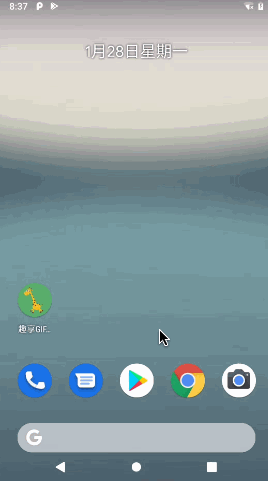
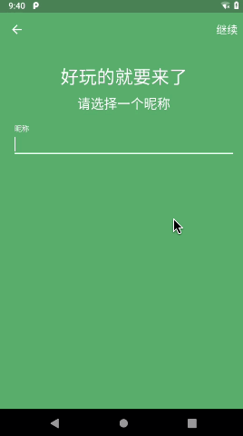
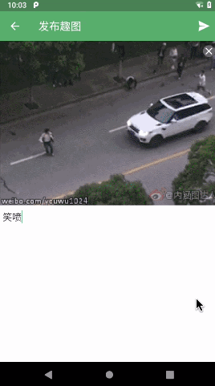
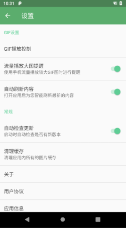
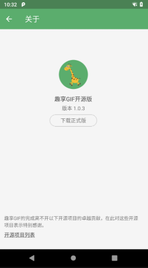

# 趣享GIF开源版 v1.0.3


趣享GIF是一款Android端开源的GIF浏览和分享App，界面基于Material Design标准进行设计。App围绕GIF为主题，建立了一个小型的社交系统，在这里你可以：

 * 查看热门搞笑的GIF图
 * 关注你喜欢的人，他的有趣分享尽收眼底
 * 有好玩的内容想让大家知道？一键发布你自己的GIF趣图
 * 对你感兴趣的内容点赞、点评，和众多网友交流
 * 喜欢的内容轻松转发至主流社交软件，传递你的快乐

更多好玩的东西等待你来探索，赶快开启你的快乐之旅吧。

微信扫一扫立刻安装：


## 屏幕截图









## License

趣享GIF的源代码仅供学习和交流使用，严禁用于任何商业用途，否则我将保留一切追究法律责任的权利。当然，如果你是通过这个App的源码学到了很多知识，然后应用到了自己的项目当中，这种我是非常欢迎的，但如果只是在我的源码基础上稍微改了改代码或者界面，然后就拿去用作赚钱目的，这种行为是不被允许的。

```
Copyright (C) guolin, Suzhou Quxiang Inc. Open source codes for study only.
Do not use for commercial purpose.

Licensed under the Apache License, Version 2.0 (the "License");
you may not use this file except in compliance with the License.
You may obtain a copy of the License at

http://www.apache.org/licenses/LICENSE-2.0

Unless required by applicable law or agreed to in writing, software
distributed under the License is distributed on an "AS IS" BASIS,
WITHOUT WARRANTIES OR CONDITIONS OF ANY KIND, either express or implied.
See the License for the specific language governing permissions and
limitations under the License.
```
